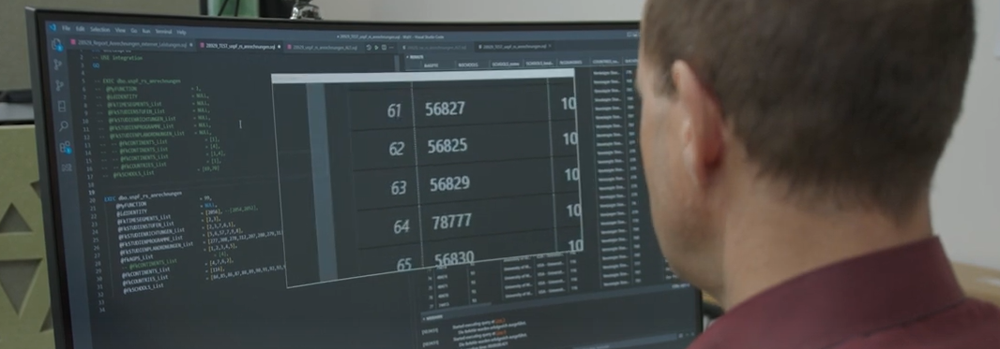

# head2screen

This Video in [German](https://youtu.be/FL9GKvcjw24) and in [English](https://youtu.be/iKTDF_K0fzY) shows the issue, an idea and possible solutions. Inputs to the project are very welcome.

## Initial situation

Magnifying screen content is central for visually impaired people. A head magnifying glass is physically demanding for daily work; conventional magnification programmes considerably reduce reading or working speed due to control via keyboard and mouse.

## Idea

Instead of magnifying with an uncomfortable head magnifying glass, the magnification is displayed electronically on the screen. The advantage of keeping the hands free for work is retained as much as possible.

## Architecture

A smartphone (currently Android only) tracks the user's head movements. Via WLAN/LAN, the movements are forwarded to a PC in the same network to move a magnifying glass window.

## Releases

Current Test Release: https://github.com/unisg/head2screen/releases

## Code

The code is made available in this [GitHub repository](https://github.com/unisg/head2screen).

## Requirements

- .NET-Runtime: If the correct version is not installed, an error message appears indicating the correct version.
- microphone connected to your pc

## Installation and configuration

### Smartphone

#### Android:
- [The APK file is installed on an android smartphone](https://www.groovypost.com/howto/install-apk-files-on-android/).
- The screen size, the offset of the camera (smartphone) and the connection (IP and port) are entered via settings in the menu at the top right of the app. For IP- und port-values see pc/configuration below.

#### iOS:
- not yet supported

### PC
- After unpacking the file, the PC app can be started without installation by opening "Head2Screen Magnifier.exe".
- The configuration of the PC app is stored in "Head2Screen Magnifier.dll.config". Make sure to restart the app on the PC after changing the config-file.
- Find comments of the parameters in this [example of the configuration file](./assets/Head2Screen Magnifier.dll.config).
- If using multiple displays, set the Windows Settings/multiple displays dropdown to "Extend these displays" and the below Settings/multiple displays checkbox to "Make this my main display".
- IP-adress and port: Set it equal on the phone as in the config-file/attribute "MyIPAddress" and "MyPort". Use the IP-address which you find in cmd/ipconfig/Wireless_LAN.
- Make sure to connect the PC with the same net (WLAN/LAN) as the phone is connected to.
- Start the PC app first before starting the phone app.
- The PC app can be closed by pressing "alt+f4" (make sure to select the head2screen windows by pressing "alt-tab").

## Modes

- Normally the app is running in the head mode. The magnification window is moved by the heads movement. The hands are free to work with keyboard and mouse.
- The mouse mode is used for easier navigation in menue structures. Therefore the magnification window is controlled by the mouse.

## Commands

To toggle from head mode to mouse mode use the spoken command "mouse mode" and vice versa "head mode".

## Contribution

As this is a pilot and the ressouces of the current leading organizations are limited we are looking for contribution in development, maintenance and support. At the moment we are not able to track every issue right in time.

## Contact

For inputs or questions use <head2screen@unisg.ch>.

## Links

- [head2screen auf GitHub](https://github.com/unisg/head2screen)
- [Projektvideo deutsch](https://youtu.be/FL9GKvcjw24)
- [Projektvideo englisch](https://youtu.be/iKTDF_K0fzY)
